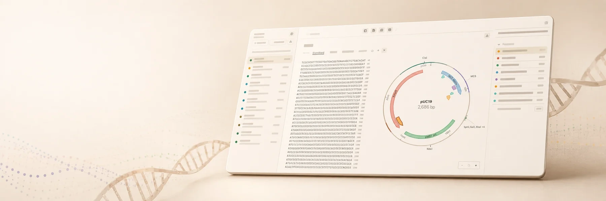

<div align="center">


# Motif

**A molecular-biology bench for Claude Science.**

Plasmid maps, restriction digests, primer design, and cloning plans,
as an artifact you can open and inspect down to the base pair.
Runs in your browser, with no Motif-hosted backend.

[Live site](https://jvogan.github.io/motif-site/) ·
[Source and installation](https://github.com/jvogan/motif) ·
[Current capabilities](https://github.com/jvogan/motif/blob/main/docs/CAPABILITIES.md) ·
[Security](https://github.com/jvogan/motif/blob/main/SECURITY.md)



[](LICENSE)
&nbsp;
&nbsp;

</div>

---

## Why Motif

The interesting moment in agentic science isn't a paragraph describing a plasmid.
It's receiving a concrete, reviewable workspace artifact and being able to
inspect every result yourself.

- **Visible artifacts.** Every step lands as a record on the bench: a map, a
  digest, a translated protein, not a wall of text.
- **Local-first.** The whole workbench is a single self-contained file that runs
  in your browser. Motif has no hosted service; content supplied to Claude
  Science remains subject to your Claude and organization data policies.
- **Auditable lineage.** Derived records remember their parent and how they were
  made, so you can trace a protein back to the bases it came from.

## What's on the bench

| Read & inspect | Cut & clone | Analyze | Transform |
| --- | --- | --- | --- |
| Circular & linear maps | Restriction digest (153 enzymes) | Six-frame ORF detection | Translation |
| Feature annotations | Primer design (Tm / GC) | NCBI genetic-code selection | Reverse complement |
| Reading-frame overlays | Gibson & Golden Gate | Browser MSA | Derived protein records |
| Live GC & length stats | PCR simulation | IUPAC motif search | Parent & provenance notes |

Import and export FASTA, GenBank, and raw sequence. Database JSON is directly
restorable; workspace ZIP and self-contained HTML are portable handoffs.

## Try it

Build the current workbench from the public source repository:

```bash
git clone https://github.com/jvogan/motif.git
cd motif
npm ci
npm run preview:motif
```

Open `preview/motif-artifact.html`. For Claude Science connector setup and the
public synthetic smoke record, follow the
[installation guide](https://github.com/jvogan/motif/blob/main/docs/CLAUDE_SCIENCE_QUICKSTART.md).

<div align="center">


*Not sure where to start? Use one of these after opening a Motif workbench:*
</div>

- `Open pUC19 and highlight the unique cutters.` → a map with single-cut enzymes flagged
- `Translate the lacZα region and save it as a protein.` → a protein record, parent recorded
- `Design primers to amplify the MCS, about 250 bp.` → a primer pair with Tm, GC, product size
- `Plan a Golden Gate assembly and flag internal BsaI sites.` → an ordered plan, Type IIS conflicts called out

## Run the landing page locally

This repo is the Motif landing site. It is static and has no build step; the
current product source and distributable build live in `jvogan/motif`.

```bash
python3 -m http.server 4178
# open http://localhost:4178
```

It's GitHub-Pages ready (`.nojekyll`, relative paths). The interactive plasmid
map, codon-translation viz, and ambient field are vanilla JS and reduced-motion
aware.

## Scope

Motif is a **design and inspection bench, not a validation service.**

- **It does:** prepare, inspect, and explain sequence artifacts; compute analyses
  deterministically and show its work; flag likely mistakes (internal cut sites,
  impossible geometry); keep provenance so results can be traced.
- **It won't pretend:** that a proposed plan has been wet-lab validated; to be a
  clinical or diagnostic tool; to have changed a construct unless you can see and
  verify it; to replace review by a qualified scientist.

## License

[MIT](LICENSE).

---

<sub>Motif is an independent, community-built plugin. It is **not** affiliated with,
sponsored by, or endorsed by Anthropic. “Claude” and “Claude Science” are trademarks
of Anthropic. Banner illustrations and the mascot are original artwork. Motif is a
research and design tool, not a clinical or diagnostic device.</sub>
